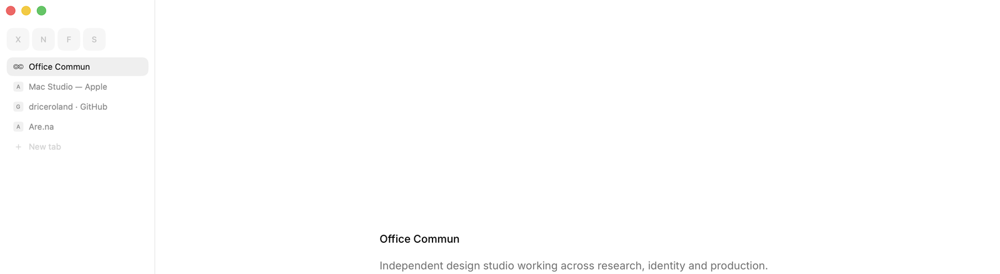

# Search

A small, fast WebKit browser for macOS, by [Office Commun](https://officecommun.com).

No Chromium, no telemetry, no account. One field for typing and searching, tabs that sleep instead of costing memory, and the handful of things a browser actually needs — reading mode, an ad blocker that runs before a page loads, picture-in-picture, passwords in your keychain — and not much else.

**[Download the signed build →](https://officecommun.com/search)**

## Why the source is here

So anyone can read exactly what a browser handling their passwords and history is doing, build it themselves, or fix something that bothers them. The code is small enough to actually read — about 11,500 lines, no dependencies beyond what Apple ships with macOS.

## Building it

- macOS 14 or later, Xcode 16 / Swift 6 toolchain
- `swift build` — runs the app straight from the SwiftPM binary
- `./build.sh` — assembles a real, double-clickable `Search.app` in `build/`, ad-hoc signed so it runs on your own Mac

A build you make yourself won't be notarized or carry Office Commun's Developer ID, so the first launch needs a right-click → Open (or an allow in System Settings → Privacy & Security) instead of opening straight away. That's expected — it's the same thing that happens with any app that isn't downloaded from the Mac App Store or a notarized DMG.

`./build.sh release dmg` also makes `Search.dmg`/`Search.zip`, if you want a disk image of your own build. `./build.sh release ship` additionally notarizes and staples — that step needs a Developer ID certificate and Apple credentials, so it only really does anything for Office Commun's own releases.

## How it's put together

- **SwiftUI** for everything drawn, **AppKit** for the handful of things SwiftUI doesn't reach on macOS (the window's title bar, dragging the window by an empty part of the tab row), **WKWebView** for pages.
- One `Tab` per page, and its web view is built lazily — a tab restored from last session doesn't cost a process until you actually switch to it. That's most of why launching with a dozen tabs open is still fast.
- No dependencies. Passwords live in the macOS keychain; the ad blocker is a `WKContentRuleList` compiled once at launch; importing from Chrome, Dia, Arc, Brave, Edge or Vivaldi reads their own local files once, with your permission, and never sends anything anywhere.
- `Sources/Search/` is one file per concern — `Vault.swift` is the keychain, `Shield.swift` is the ad blocker, `Session.swift` is what gets restored on launch, and so on. There's no framework of its own to learn first.

## Contributing

Issues and pull requests are genuinely welcome — see [CONTRIBUTING.md](CONTRIBUTING.md) for the short version of how this is reviewed and what tends to get merged.

## License

MIT — see [LICENSE](LICENSE). Do what you want with the code. "Search" and the app icon are Office Commun's; please rename a fork before distributing it under a different name.
